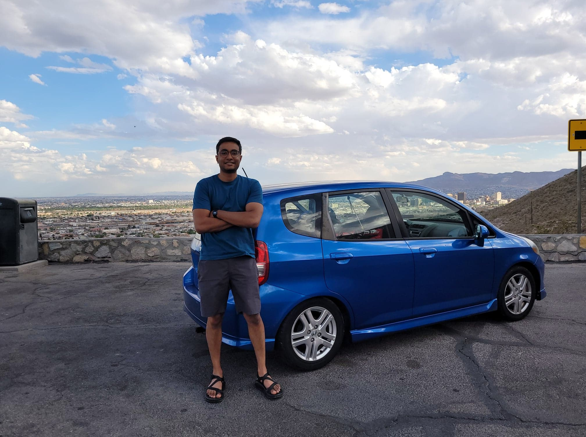
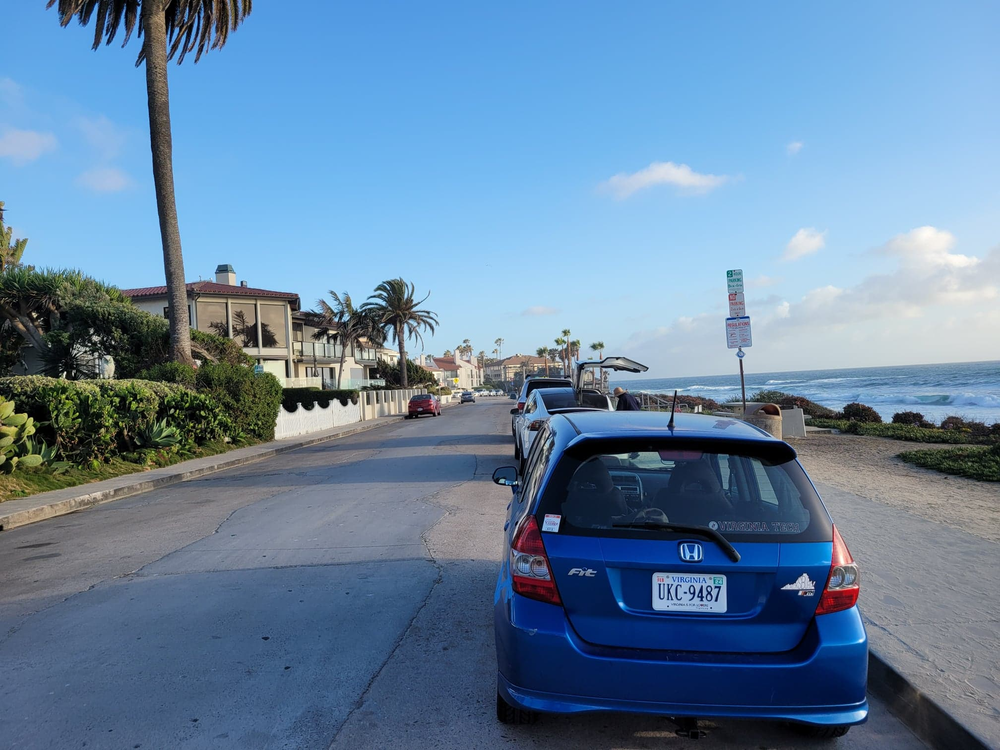

Earlier this month I drove from Blacksburg Virginia to San-Diego California. The trip took 4 days and 3 nights, covering approximately 800 miles and 10hours on the road each day, totalling about 2450 miles, or just under 4000km. The vehicle I was in was very old, small, light, and slightly overladen - making every experience more visceral than it would have been in a larger more capable car.  

This was a good thing: besides exercising my perseverance, it also demonstrated in some sense the unnecessary excesses that we often convince ourselves are necessary in order to even start thinking about doing anything, and to some extent the things we don't think about enough of.  

 awkward pose at Scenic Dr, El Paso, Texas 

 Pacific Ocean reached! Coast Blvd, La Jolla, California 

I picked up a few pointers along the way for trips like these that I thought might be useful - summarized below.  

*Note that this trip was done during late spring early summer around the southern part of the United States - be mindful of contextual relevance. These are all personal opinions and not general advice. You are responsible for your own actions.*

# Routes

Stay on national highways (Interstate highways in the US) and avoid other freeways, unless you have done enough research on them and are prepared. The US has a healthy amount of road side stops for gas or food, however I noticed these become increasingly scarce the further west you get from around Texas. If you are used to driving around the east, south east, or north eastern parts of the United States, be wary that your default estimates for road-side gas stations or food opportunities might be optimistic.  

Do some research on road conditions around where you're at. I ran tires that did superbly around the east coast, and were  healthy before my trip. But in the deserts of the south western states where ambient temperatures were quite high and the roads were rough with lots of sand and debris, my tires got absolutely destroyed. Likely worth just putting on a new set of extra beefy tires - don't skimp out on cost here!

Know when you will be around areas with high winds, dust storms, and bad weather conditions. The stretch of the I10 and I80 from Tucson Arizona to San Diego, while jaw-droppingly vast and beautiful, can get hazardously windy, especially around Pine Valley just before entering San Diego. Never have I been hunched over my wheel with a death grip and laser focus attention like I was going through this stretch. My tiny Honda Fit was getting thrown around and I constantly had to correct - it was quite jarring. If you have a tall vehicle or a lot of lateral wind resistance you will be more susceptible to these conditions. Semi's stopped along the roadside are a common sight. Do not compete with locals in these areas, let them pass you.  

# Insurance

This goes without saying - get [AAA](https://cluballiance.aaa.com/?zip=24060&devicecd=PC). It has nationwide coverage and is a good safety net. A more comprehensive insurance coverage would also be wise. Because I run a cheap old beater, my insurance was the minimum mandated by the state of Virginia - $25,000 per person and $50,000 per accident for bodily injury, and $20,000 per accident for property damage (not including your own property). Tacking on some personal liability would be very helpful in case you need to make insurance claims after severe accidents, thefts etc. I did not have this. Don't be like me.

# Gear

## Stuff to check before you leave

Go to a shop and get a full all around diagnosis. Change your oil. Check your coolant and transmission etc fluids and determine if those need to be changed as well. Get fresh filters (cabin and engine) because these will likely get destroyed on super long trips. Seriously assess the condition of your tires and be somewhat liberal when deciding to get a new set of solid high quality all season tires. Tire's see the most beating and screw you the quickest and hardest when they fail. If possible carry full size spares. At minimum have a compact spare - not ideal, but it is what I had. Non full-size spares limit you to a low top speed (50mph in my case) and you cant depend on it to go very far - if you are in a remote area having full size spares are a must. Also compact spares need to be at a fairly high pressure before use, which will often not be the case when you pull it out of your spare tire well having never been used, necessitating some way to pump it up. If you have a non full size spare tire, get a decent 12V air pump like [this](https://www.amazon.com/gp/product/B07MKSP49L/ref=ppx_yo_dt_b_search_asin_title?ie=UTF8&psc=1) one.  

## Recovery and Vehicle stuff

Sometimes AAA can be soul crushingly slow. One of my tires blew on the New Mexico/Texas border and it was a super harrowing experience having been immobilized on the left side of a busy interstate. I did however pack my own tools: a small hydraulic jack, a comprehensive automotive socket set, a tire pump/air compressor, tire patch kit (not helpful for totally blown tires obviously, but still a good thing to have), back-up jump-starter (NOCO Boost Plus). With these I was able to quickly jack up my car, install in my temporary spare, and get myself to safety. However I had a lot in my favor: it was early morning, plenty of daylight, there were lots of people around me, I was not too far from a town with a reputable tire shop, and I had full cellular connection with data. Think about how you might want to optimize for these conditions and have backups for when you find your self lacking any of them. e.g. if you know your are at risk of being in low-cell coverage areas bring something like a Garmin inReach that will give you some kind of global communication link no matter where you are; start early morning and make use of daylight as much as possible; take frequently travelled routes; don't stray too far from populated areas for too long.  

Not having to use the stock screw jacks and lug nut wrenches that come with cars saved me a significant and meaningful amount of time, energy, and morale. Do a little test tire swap with your equipment before hand just so you know what the process is like. Lug nuts are super hard to get off in most cases. Unless you are either incredibly strong or masochistic, you will need some kind of breaker bar. I did not have one, but I did have a steel 1-1/4" trailer hitch bicycle mount, which I used to hammer the socket wrench attached to the lug nuts. This worked, but was not ideal. Don't be like me, stick a breaker bar in your spare tire well.

When your tire explodes and your car is resting on its rims, you're not going to have a lot of ground clearance. This loss of ground clearance is exacerbated by having a car with already low ground clearance, and stopping by road side dirt surfaces or uneven asphalt. The result: you're going to have a very hard time getting your jack under your car to begin with. I had to do a lot of vehicular yoga to get enough clearance in order to wedge my jack underneath my left rear jack spot. Learn where the safe jack spots around your car are! Another helpful tip would be to pack a small shovel for the case when you have no alternative but to dig under your jack spot to get clearance (learnt this from a friendly local trucker who was getting his car serviced at the tire shop that was mending my exploded tire in Antony Texas).  

Pack duct tape and a good knife/multi-tool (a Leatherman Wave or Surge with a bit kit is ideal). The tire explosion incident unseated some plastic body panels over my rear bumper, which ended up almost completely ripping off after several hours of 50+mph winds in the deserts of Arizona. Some quick duct tape work held it together very securely and it wasn't an issue for the remainder of the trip.  

I have a very small gas tank - about 9 gallons. I also get great mileage - just under 40mpg. On long drives of cruising around 80ish mph, I last approximately 4 to 5 hours from a full tank before having to start looking for gas stations. I had a backup 5 gallon gas canister that was always full in case I needed it - this was extremely comforting through West Texas and beyond where gas stops were quite sparse. I never ended up needing to utilize it, but I know I came close many times. To avoid storing gas over night, when I was within my estimated 4-5 hours range of my destination I'd top up my tank with my canister. Make sure to vent your canister every few hours.  

## Security

I bought some cheapo window blinds for when I had to park overnight in sketchy areas. Don't get Motels in sketchy areas, but also don't rule out the possibility that you may end up being in one. These are super cheap and compact to just have on hand.  

I also had bear-mace easily reachable (because why have pepper spray when you can go all the way), just in case. Don't be defenseless, have something to defend yourself with, and be intelligent about where you store it and your behavior with it.  

## Music

A killer playlist and good audiobooks/podcasts are seriously helpful in maintaining attention, morale, and keeping your 'driving autopilot trance' alive. Look up 'highway hypnosis'.  

## Driving Clothing

Anything comfortable. Neck pillows. A good armrest situation. Comfy Chacos or other footwear. All of these go a long way. Do not wear flip flops or excessively loose footwear - do not underestimate the possibility that you loose mobility around your pedals because your flip flops or whatever floppy footwear you're wearing gets jammed somewhere, and you cant accelerate or brake in time.  

# Food

It is worth spending time to master the art of eating and driving safely. Sandwiches, burgers, CLIFF bars etc are all driving conducive foods.  

Know what drinks/foods are more or less likely to send you to the bathroom and choose wisely. But always Hydrate!  

# Driving Tips

Learning ['Defensive Driving'](https://en.wikipedia.org/wiki/Defensive_driving) is a seriously wise decision I strongly believe everyone should do. Look it up, learn what it is, and find a place near you where you can get hands-on training. Basic control skills, evasive maneuvers, and intuition about vehicle controls go a very long way in keeping you and others safe. Be honest with your self and your driving confidence. Complacency kills - don't underestimate the probability of you getting caught in problematic situations, arm yourself with the skills to deal with them.  

Know your car and its limits! Pay attention to the details. Learn about how it responds to adverse conditions - too much wind, slippery roads etc. Learn about what speeds it can comfortably cruise at without having to struggle at high RPM's. Do a little bit of research about how cars work; where your transmission is; if your car front, rear, or all wheel drive; how to configure your traction control settings if you have them; if you have ABS and if its working; all of that. There is no such thing as too much knowledge. Google around! Don't be ignorant about the things you depend on!

  
